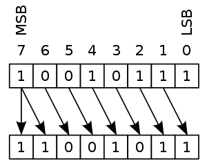
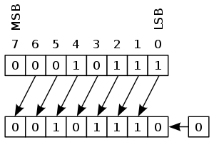

从几年前（大概是17年吧）初学 C++ 到不久前，都没理解 *位运算* 的意义，看别人写的算法或多或少也都有位运算参与，~~看不懂~~。这就很令人伤心了，于是决定好好研究一下这个 *位运算*

> 💡 **Tips:** 由于这篇文章是我的笔记，可能有一些废话，如果你是奔着位运算来的，不希望看过多的废话，请戳 *TL; DR*, 或者[点这里直达二进制运算](#二进制运算) 或者直达 [位运算的奇淫技巧](#位运算的奇淫技巧)

# 历史遗留问题

---

## [TL; DR](#二进制究竟是啥)

计算机只认识 **二进制** 数字，也是基于 *二进制* 完成计算和其他工作；选择 *二进制* 的两个原因是存储效率和设计难度

---

众所周知，**计算机只认 *二进制* 数** ，所以他是不认我们的十进制数滴，当然也不认什么八进制，十二进制，十六进制，六十进制，blablabla

<details>
<summary></summary>
虽然某国三进制计算机 <i>Сетунь</i> 认的是三进制，<s>可是你用的不是 C*****，所以就不要想那么多了</s><br>
当然，<i>ENIAC</i> 用的是十进制，可你用的也不是 E****
</details>


## 为什么是二进制

选择二进制当然是有原因的，历史原因~~不可避免的~~成为主要原因，但是，在那个寸 bit 寸金的年代里，效率和设计难易程度也直接导致了计算机选择二进制。

关于效率，这里直接抄 [某个知乎老哥](https://www.zhihu.com/question/314924440/answer/617706217) 的解释[^1]

[^1]: 为什么进制接近e最有效率? - [知乎用户的回答](https://www.zhihu.com/question/314924440/answer/617706217)(编辑于 2019-03-09 15:22)

设$r \in R, r \gt 0$为进制数，即 $r$进制.

假如这里有 $n$ 个坑 _ _ _ _ ... _，那么可表示 $m = r^{n}$ 个数.
每个坑可以填 $r$ 种符号，也就是说，每个坑有 $r$ 种状态，$n$ 个坑共有 $s = r \cdot n$ 种状态.

前面提到过，那个年代寸 bit 寸金，所以存储效率最高的就是最合适的，用数学语言描述就是：为了表示 $m$ 个数，当 $r$ 为多少时，$s$ 可取得最小值？

然后就有 $s = \frac{r}{\ln (r)} \ln(m)$

对 $r$ 求导，可得 $r = e \approx 2.71828182845904523536\cdots$ 时，$s$ 取最小值 $e \cdot \ln(m)$

很明显，**$r = e$ 是最优情况**，**但是**，$e$进制 的电路很明显是不切实际的，所以，在存储效率方面 **三进制** 成了最优选择，**二进制** 次之，然而 *二进制* 的逻辑运算比 *三进制* 简单不少（至少是在电路设计上），损失一点存储效率，也算是 *鱼与熊掌* 吧.

~~啥？你问我为什么简单？？鄙人不配，请戳[这个](https://www.bing.com/)，[这个](https://www.google.com)，[这个](https://www.baidu.com/) 或 [这个](https://www.duckduckgo.com/)~~

<details>
<summary></summary>
你要是非要我说，我只能扯些淡了<br />
比如说“道生一，一生二，二生三，三生万物”<br />
或者说 三进制可以认为 Bool 值有三个，即 真 不知道 假，可是纸带上的控只有打了和没打，不存在不知道打没打（喂，这不是加速度） <br />
或者说 二进制只要高低电平 简单呗，就像我们有十根手指头一样 

附个 v2ex 的链接吧 https://v2ex.com/t/114165
</details>

# 二进制究竟是啥

---

## [TL; DR](#二进制运算)

**只通过1或0表示数字, 逢2进1** 的计数系统

---

那这个 *二进制* 究竟是个什么东西呢，先从 [Wikipedia](https://zh.m.wikipedia.org/wiki/%E4%BA%8C%E8%BF%9B%E5%88%B6) 抄一段 ~~富有文化气息的高大上的~~   **而且看不懂** 的解释：

> 二进制（binary）在[数学](https://zh.m.wikipedia.org/wiki/%E6%95%B8%E5%AD%B8)和[数字电路](https://zh.m.wikipedia.org/wiki/%E6%95%B8%E4%BD%8D%E9%9B%BB%E8%B7%AF)中指以2为[底数](https://zh.m.wikipedia.org/wiki/%E5%BA%95%E6%95%B0_(%E8%BF%9B%E5%88%B6))的记数系统，以2为基数代表系统是二进位制的。

~~扯这些高大上的东西，就不像是百科全书的样子.jpg~~

底数是个啥玩意？既然它扯了，那我们顺着链接点下去，了解一下吧

> 进位制的底数（radix， base）是指此进位制中，用于表示数所使用的数字符号（包括0）数量。以目前最常使用的十进制为例，每一位的数字可以从0至9，共10个数字，因此底数为10。

熟悉吗？熟悉就对了，我们刚刚才[提过](#为什么是二进制)，所谓 $r$进制 就是每个“坑”需要 $r$ 种状态，$r$ 就是**底数**

一个数和它的底数用 $(x)_y$ 表示，如 $(10)_2$ 表 $3$

## 底数和数的关系

### 纸上得来终觉浅

设有正整数 $(x)_b$ , 其中 $b$ 为进制, $d_n$ 表示 x (从左往右) 第 $n$ 位数的值

可推出 $0 \le d_n \lt b, n \in N$

那么 $b$进制 数的值为
 $d_1b^{n-1} + d_2b^{n-2} + \cdots + d_nb^0$

> ⚠️ **注意:** 这里的 $b$ 也可以是负数，分数... 但是 **不能** 为 $0$, 原因在于 $0^0$ 不是 $1$, 也就不是 *个位*

其第 $n$ 位数分别是 $b^n$位，$b^{n-1}$位，$\cdots$，$b^1$位，$b^0$位(个位)[^2]

[^2]: ~~感谢 Wikipedia 帮查的资料~~，Mano, M. Morris; Kime, Charles. Logic and Computer Design Fundamentals 4th. Harlow: Pearson. 2014: 13–14. ISBN 978-1-292-02468-4 及 [Binary: How Do Computers Talk?](https://experimonkey.com/articles/?aid=binary-how-do-computers-talk) <sup>但是这个链接挂了 <s>当然 WebArchive 也没有</s></sup>| Experimonkey. [experimonkey.com](experimonkey.com) [2018-12-02].

### 绝知此事要躬行

以数字 $(100)_{16}$ 为例

其值应为 $1 \times 16^{2} + 0 \times 16^{1} + 0 \times 16^{0} = 256$

相应的，$1$ 应该是 $256$位，第一个 $0$ 是 $16$位，第二个 $0$ 是 个位

#### 解释

~~我觉得，应该不用解释吧...~~

刚刚举了16进制的例子，现在看看10进制

比如 $(111)_{10}$

其值应为 $1 \times 10^{2} + 1 \times 10^{1} + 0 \times 10^{0} = 111$

是不是，突然就看懂了！

如果没看懂，想一想小学是不是做过求一个数字十位、个位的题目，那个式子是 $\text{十位上的数字} \times 10 + \text{个位上的数字} \times 1$

这个 *十位上的数字* 和 *个位上的数字* 分别是 $d_{n-1}$ 和 $d_n$

再把 *其第 $n$ 位数分别是 $b^n$位，$b^{n-1}$位，$\cdots$，$b^1$位，个位* 翻译到十进制中就是

其第 $n$ 位数分别是 $10^n$位,$10^{n-1}$位, $\cdots$, $10^1$位, 个位，也就是 *个、十、百、千、万* 等

或者，直接利用下面这张表[^3]理解 ~~虽然它是给计量单位的~~

所表示的因数就是我们说的 $b^n$，不难看出 $b^n$位 与下面的这些 *词头* 只不过是有名字和没名字的关系罢了

| 所表示的因数 | 词头名称 | 词头符号 |
|---|---|---|
| $10^{24}$ | 尧[它] | Y |
| $10^{21}$ | 泽[它] | Z |
| $10^{18}$ | 艾[可萨]| E |
| $10^{15}$ | 拍[它] | P |
| $10^{12}$ | 太[拉] | T |
| $10^{9}$  | 吉[咖] | G |
| $10^{6}$  | 兆     | M |
| $10^{3}$  | 千     | k |
| $10^{2}$  | 百     | h |
| $10^{1}$  | 十     | da |
| $10^{-1}$ | 分     | d |
| $10^{-2}$ | 厘     | c |
| $10^{-3}$ | 毫     | m |
| $10^{-6}$ | 微     | μ |
| $10^{-9}$ | 纳[诺] | n |
| $10^{-12}$ | 皮[可] | p |
| $10^{-15}$ | 飞[母托] | f |
| $10^{-18}$ | 阿[托] | a |
| $10^{-21}$ | 仄[普托] | z |
| $10^{-24}$ | 么[科托] | y |

[^3]: *《中华人民共和国法定计量单位》* 中的 *表5 《用于构成十进倍数和分数单位的词头》* --- [百度百科](https://baike.baidu.com/item/%E4%B8%AD%E5%8D%8E%E4%BA%BA%E6%B0%91%E5%85%B1%E5%92%8C%E5%9B%BD%E6%B3%95%E5%AE%9A%E8%AE%A1%E9%87%8F%E5%8D%95%E4%BD%8D/374931)


搞明白这个，再看 $d_1b^{n-1} + d_2b^{n-2} + \cdots + d_nb^0$ 是不是就明白了呢？

~~再不明白我也没办法了~~

### 其他一些事

- 对于负数，只需要加上“$-$”号

- 对于小数，$b^0$位右边，令 $n \lt 0, n \in Z$ 即可

## 回到二进制上

有了上面的一堆~~废话~~, 那么我们就知道任何 **二进制** 的正整数可以表示为 $d_12^{n-1} + d_22^{n-2} + \cdots + d_n2^0$，这也是 *二进制* 转换为 *十进制* 的方式

由 $0 \le d_n \lt b$ 我们可知, *二进制* 中每一位上的数只能是 $1$ 或 $0$，也就是常说的 ***逢二进一***

# 二进制运算

## 四则运算

- 加: $0 + 0 = 0$, $1 + 0 = 1$, $1 + 1 = 10$



$
\begin{array}{r}
10010101\\
+01001011\\
\hline
11100000
\end{array}
$



- 减: $0 - 0 = 0$, $1 - 0 = 1$, $10 - 1 = 1$, $1 - 1 = 0$



$
\begin{array}{r}
10010101\\
-01001011\\
\hline
01001010
\end{array}
$



- 乘: $0 \times 0 = 0$, $1 \times 1 = 1$

- 除: $0 \div 1 = 0$, $1 \div 1 = 1$

## 位运算（位操作）

还是从 [Wikipedia](https://zh.m.wikipedia.org/zh-hans/%E4%BD%8D%E6%93%8D%E4%BD%9C) 抄一下

> 位操作是程序设计中对位数组或二进制数的一元和二元操作。

利用 *位运算* 达成目标，相较于 *四则运算* 使用的资源 **更少** , 因此功耗 **更低** ，而且速度 **更快**

> 💡 **Tips:** 下面所有位操作相关的运算使用[补码](#补码)

### 取反(`NOT` 或 `~`)

取反是 *一元运算符* ，在大多数现代编程语言中使用 `~` 表示. 它会对一个 *二进制数* 按位做 *逻辑非(`!`)* 操作.

比如，`~ 1000` 得 `0111`

> 💡 **Tips:** 对某值取反等于该值的相反数减去一，即 $ ~x = -x - 1$

> ⚠️ **Warning:** 逻辑非(`!`)并不是取反(`~`)，绝大多数语言会将 *逻辑非* 作为布尔值的运算符，而不是位操作

### 按位 或(`OR`, `|`) 、异或(`XOR`, `^`)、与(`AND`, `&`)

> ⚠️ **Warning:** 逻辑或(`||`)、逻辑与(`&&`) 与 *按位或* 、 *按位与* 不同

它们都得 *二元运算符* ，对二进制中每一个位作相应的逻辑操作.

- **逻辑或:** 两个操作数中任意一个为1，则取1
- **逻辑异或:** 两个操作数中有且仅有一个为1，则取1
- **逻辑与:** 两个操作数都取1，则取1

### 如上内容的数学等价物（来自 [Wikipedia](https://zh.m.wikipedia.org/zh-hans/%E4%BD%8D%E6%93%8D%E4%BD%9C#%E6%95%B0%E5%AD%A6%E7%AD%89%E4%BB%B7%E7%89%A9) ）

假设${\displaystyle x\geq y}$，对于非负整数（好像是原码），按位运算可以被写成如下形式：



${\begin{aligned}\operatorname {NOT} x&=\sum _{n=0}^{\lfloor \log _{2}(x)\rfloor }2^{n}\left[\left(\left\lfloor {\frac {x}{2^{n}}}\right\rfloor {\bmod {2}}+1\right){\bmod {2}}\right]=2^{\left\lfloor \log _{2}(x)\right\rfloor +1}-1-x\\x\operatorname {AND} y&=\sum _{n=0}^{\lfloor \log _{2}(x)\rfloor }2^{n}\left(\left\lfloor {\frac {x}{2^{n}}}\right\rfloor {\bmod {2}}\right)\left(\left\lfloor {\frac {y}{2^{n}}}\right\rfloor {\bmod {2}}\right)\\x\operatorname {OR} y&=\sum _{n=0}^{\lfloor \log _{2}(x)\rfloor }2^{n}\left(\left[\left(\left\lfloor {\frac {x}{2^{n}}}\right\rfloor {\bmod {2}}\right)+\left(\left\lfloor {\frac {y}{2^{n}}}\right\rfloor {\bmod {2}}\right)+\left(\left\lfloor {\frac {x}{2^{n}}}\right\rfloor {\bmod {2}}\right)\left(\left\lfloor {\frac {y}{2^{n}}}\right\rfloor {\bmod {2}}\right)\right]{\bmod {2}}\right)\\x\operatorname {XOR} y&=\sum _{n=0}^{\lfloor \log _{2}(x)\rfloor }2^{n}\left(\left[\left(\left\lfloor {\frac {x}{2^{n}}}\right\rfloor {\bmod {2}}\right)+\left(\left\lfloor {\frac {y}{2^{n}}}\right\rfloor {\bmod {2}}\right)\right]{\bmod {2}}\right)=\sum _{n=0}^{\lfloor \log _{2}(x)\rfloor }2^{n}\left[\left(\left\lfloor {\frac {x}{2^{n}}}\right\rfloor +\left\lfloor {\frac {y}{2^{n}}}\right\rfloor \right){\bmod {2}}\right]\end{aligned}}$



### 移位

位移操作是我花了很久才理解的玩意儿，是利用某个 计算器App 的位键盘才大概明白是个啥玩意，最近我才知道有 *逻辑移位* 和 *算式移位* 等几种位移（下列图片来自 [Wikipedia](https://zh.m.wikipedia.org/zh-hans/%E4%BD%8D%E6%93%8D%E4%BD%9C)）

- **算术移位:** 左移补0，右移补符号位


*算术左移*[^4]

[^4]: 这其实是逻辑左移的图


*算术右移*

- **逻辑移位:** 左右移都补0，因此 *逻辑左移* 等价于 *算术左移*


*逻辑左移*


*逻辑右移*

据 Wikipedia 所说，在类 C 语言和 Python 中，是 *逻辑移位* ，但是据我观察，C++ 是 *算术移位* ( 使用 `GCC g++ 12.2.0`)

```cpp
#include <iostream>
using namespace std;

int main() {
    short a = -32768; // 1000 0000 0000 0000
    a = (a >> 1); // 1100 0000 0000 0000
    cout << a << endl; // 输出 -16384
    return 0;
}
```

关于无符号位移：无符号位移就是不管符号的位移...它会直接无视符号位，也就是说，它会把一个数字视为 `0数字`，0 是符号位

## 二进制与十进制的转化

### 二进制 -> 十进制

我们知道二进制可以表示为 $d_12^{n-1} + d_22^{n-2} + \cdots + d_n2^0$ (参见[回到二进制上](#回到二进制上) 一节)，这就是 *二进制* 转化为 *十进制* 的基本方法（可称为 ***按位计数法*** ），可是在转换较大的二进制数时，**幂运算会把你折磨死**，这时，就需要一个 *Plan B* 了

#### Plan B --- 双倍法

这个时候写一段程序说明如何转换会让人愉悦

* Python

```python
def bin_to_dec(n: str) -> int:
    # return int(n, 2) (bushi)
    last = 0
    for i in n:
        last = last * 2 + int(i)
    return last
```

* C++

```cpp
int bin_to_dec(const string &n) {
    int last = 0;
    for (char i : n)
        last = last * 2 + (i - '0');
    return last;
}
```

* C

```c
int bin_to_dec(const char* n) {
    int last = 0;
    while (*n != '\0') {
        last = last * 2 + (*n - '0');
        n++;
    }
    return last;
}
```

* Java

```java
public final class Bin2Dec {
    public final static int bin2dec(final String n) {
        int last = 0;
        for (char i : n.toCharArray())
            last = last * 2 + Character.getNumericValue(i);
        return last;
    }
}
```

---

什——么———？你还是想听人话？

假设要把 $1011001_2$ 转换为十进制

<!---无聊的小伙伴才能发现的彩蛋，这里的代码块指定的语言是 NL-Chinese--->
```NL-Chinese
1. 从它最左边的数开始；在 1011001 中，是第一个 1
2. 每向右移动一位，就计算
2 * 前一次计算得到的值 + 当前位数上的数字
；在 1011001 中是
第二位 0 : 2 * 1 + 0 = 2
第三位 1 : 2 * 2 + 1 = 5
第四位 1 : 2 * 5 + 1 = 11
第五位 0 : 2 * 11 + 0 = 22
第六位 0 : 2 * 22 + 0 = 44
第七位 1 : 2 * 44 + 1 = 89
( 其实第一位是 )
第一位 1 : 2 * 0 + 1 = 1
3. 最后一次计算得到数字就是十进制数
```

### 十进制 -> 二进制

十进制转二进制的转换有两种方法比较常见，这里称为 *余数短除法* 和 *降幂法*

#### 余数短除法

还是用一段代码解释吧 `:-)`

```python
def dec_to_bin(n: int) -> str:
    if n == 0:
        return "0"
    if n < 0:
        return "-" + dec_to_bin(-n)
    bin_str: list[str] = []
    while n != 0:
        bin_str.append(str(int(n % 2)))
        n = (n - (n % 2)) / 2
    return "".join(reversed(bin_str))
```

用人话解释：

```NL-Chinese
1. 将数字除以 2，记下余数，用得到的商减去余数
2. 使用 步骤1 得到的结果重复 步骤1 直至商为 0
3. 将记下的余数逆向连接起来，就是目标二进制数
```

#### 降幂法

```python
def dec_to_bin(n: int) -> str:
    bin_str: list[str] = []
    power = 0
    while n >= 2 ** (power + 1): # 确定最大幂
        power += 1
    while power >= 0: # 降幂
        print(n)
        if n - 2 ** power < 0:
            bin_str.append("0")
        else:
            n -= 2 ** power
            bin_str.append("1")
        power -= 1
    return "".join(bin_str)
```

人话就是

```NL-Chinese
1. 令 f(x) = 2 ^ x
2. 求出 f(x) 不超过十进制数的最大值
3. 从 x = 0 开始列表直到为步骤 2. 中的值（x是自然数）
4. 将待转换数字与最大值做差，再与小于此次差的最大值做差，重复，直到为0
5. 在表格中减数的下方写上1，其他地方写上0，就是答案
```

# 原码、反码和补码

咱这会用尽可能通俗的方式介绍这三个玩意，如果有更多的求知欲，可以去 Wikipedia 上阅读，[戳这可直达 原码 的 Wikipedia 页面](https://zh.m.wikipedia.org/wiki/原码)

## 原码

原，就是原，没有改变的码，就是原码（暴论

也就是说，原码表示为 `符号 + 数值` 的形式；举个例子：11 原码: +1011；-11  原码: -1011

第一位可以表示符号，正数0负数1，最后就变成了 01011 和 11011

原码的好处是显而易见的，那就是，能第一眼看到数值，坏处也是显而易见的，它不能直接参与运算

## 反码

反，就是反，在原码的基础上反过来，就是反码（暴论

这个反，意思是按位取反，对于负数，在原码的基础上，对表示数值的位按位取反，得到的就是反码

打个比方，-11 的原码是 11011，那么它的反码就是 1011 按位取反再在前面加 1，就是 10100

反码，是没有什么好处滴，看上去它能直接参与运算了，实际上，只要差了个符号，就会有 1 的误差

问题就在 0 上了，0 的反码即是 00 也可以是 10，所以，就有了补码

## 补码

补，就是补，在反码的基础上补一，就是补码（暴论

这个补，意思是补一，对于负数，给它的反码加个一，就得到了补码

还是用 -11，-11 的反码是 10100 给它加 1 就是 10101

这样就算是解决了计算的问题（

# 位运算的奇淫技巧

这应该算是本文最核心的内容，在 ~~铺垫了~~ 或者说 ~~水了~~ 478行后开始写 ~~才开始写~~ 的内容，话不多说，切入正题

## 判断数字的奇偶

二进制是以二为底的，而偶数则是二的倍数，所以，任何偶数在二进制中末位都是 0，奇数则都是 1，那么只要把数字和 1 作与运算，看看值是 1 还是 0，就有结果了

举个例子

```
 11 01011
& 1 00001
       1
```

## 求整数绝对值

任何一个数右移其补码长度减一得到的结果，就是其符号位填充了整个补码的结果，也就是说，负数一定为 -1，非负数一定为 0，对负数的补码按位取反再加一，得到的就是它的绝对值，而任何数异或 -1 的结果等于它取反。

对于补码长度为 N 的数 x，其绝对值为`(x ^ (x >> N)) - (x >> N)`

# Last

`Date: 2022-09-26T02:17:14+08:00` -> `Date: 2022-12-29T01:40:08+08:00`

可算是，写完了，睡觉！